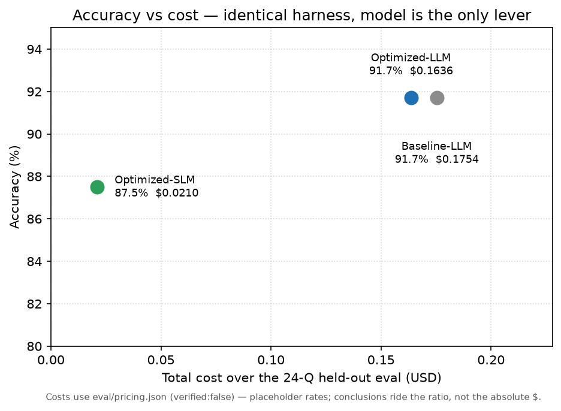
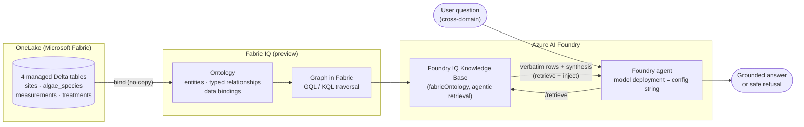
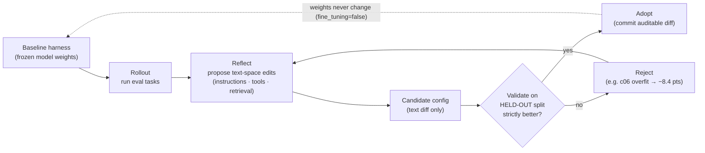
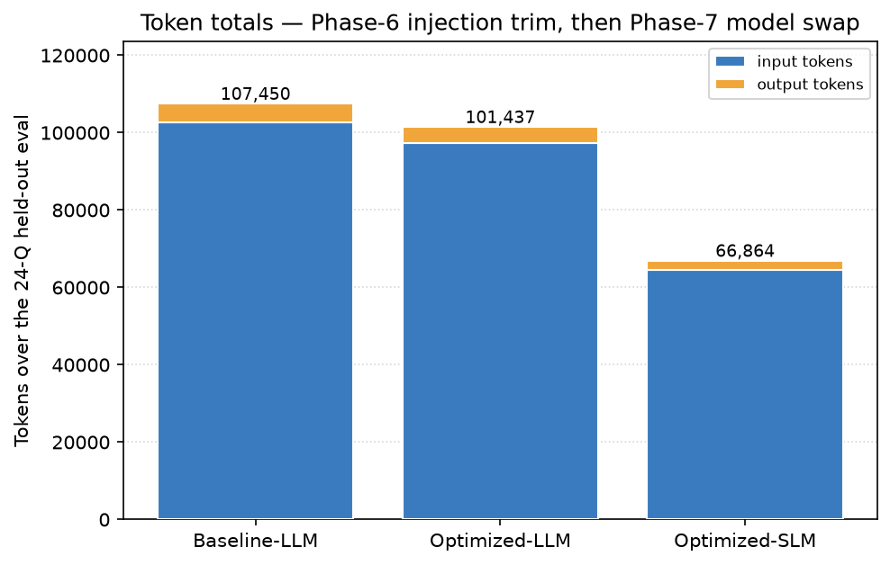
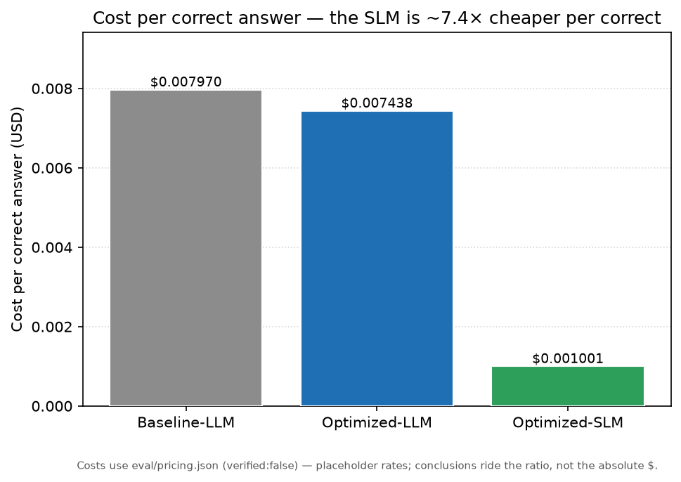
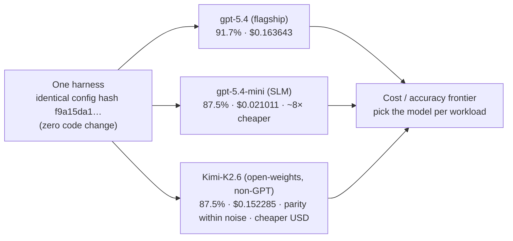
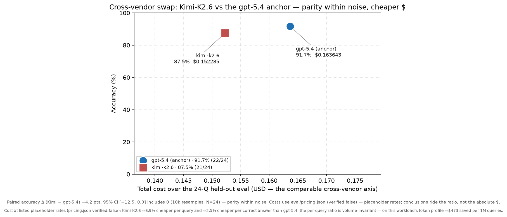

<!--
  Root README = the canonical hub-and-spoke article (Issue #33, EPIC G #7).
  Every technical claim cites docs/verified-capabilities.md with preview/GA status + date (Art. I).
  Result numbers are pulled verbatim from eval/scorecards/*.json and eval/showdown/RESULTS.md.
  Charts are generated reproducibly by scripts/make_charts.py.
-->

# Optimize the Harness — Non-Parametric Learning on the Microsoft IQ Stack

**Thesis.** Put the *truth* of your enterprise data — its schema, vocabulary, and join logic — in a
**semantic layer** (Fabric IQ), treat the model as a **swappable commodity behind config**, and improve the
agent by optimizing **text** (instructions, tools, retrieval, model selection). This repo proves it end-to-end on a water-utility algal-bloom scenario, with an auditable trail and
**real, reproduced numbers**.

---

## TL;DR — three honest findings

1. **The semantic contract holds (Fabric IQ grounding).** With semantics in the ontology, the grounded agent
   is **100% ontology-grounded** across every run, answers **multi-hop** graph-traversal questions at **90%
   (9/10)**, and **fails safe** on unanswerable questions (**6/6 refusals**) instead of hallucinating.
   *(Phase 5; [`eval/scorecards/baseline_gpt-5.4.json`](./eval/scorecards/baseline_gpt-5.4.json), verified-capabilities §2.)*
2. **Non-parametric optimization cuts tokens at zero accuracy loss — with two honesty lessons.** A
   mechanism-justified injection trim holds accuracy **exactly** (91.7%, 22/24) while cutting **~40% of input
   tokens on a controlled, identical-rows basis** (raw single-run net was only **−5.6%**, masked by
   retrieval-volume noise — we lead on the controlled number and disclose both). The trim is an **auditable
   text diff**. We also **openly report** a cautionary result: the naïve full-loop DEV winner (`c06`)
   **overfit** the tiny DEV split and regressed **−8.4 pts** on the held-out set, so it was **not adopted**.
   *(Phase 6; [`eval/optimization_runs/20260708T064838Z/RESULTS.md`](./eval/optimization_runs/20260708T064838Z/RESULTS.md).)*
3. **The model is swappable — within noise, but not a strict Pareto win.** With the **identical, unmodified
   harness** and **zero code change** (only the deployment string moved), a smaller `gpt-5.4-mini` **matches
   the flagship within statistical noise** (paired Δ **−4.2 pts, 95% CI [−12.5, 0.0] — includes 0** at N=24;
   its two genuine misses are **shared and identical** with the flagship) at **~12% of the cost (~8× cheaper)**.
   It is **not** a strict Pareto win — **87.5% < 91.7%**, stated plainly. The honest **cost/accuracy frontier**
   is the story. *(Phase 7; [`eval/showdown/RESULTS.md`](./eval/showdown/RESULTS.md).)* And it holds **across the
   vendor boundary too:** the **identical** harness with the reasoning/answer model swapped (config string only)
   to the **open-weights, non-GPT `Kimi-K2.6`** reaches **parity within noise** (paired Δ **−4.2 pts, 95% CI
   [−12.5, 0.0] — includes 0** at N=24) while being **cheaper in USD on every axis** on the same GlobalStandard
   SKU — Headline #2 leveling up from within-GPT-family to cross-vendor.
   *(EPIC H; [`eval/showdown_xvendor/RESULTS.md`](./eval/showdown_xvendor/RESULTS.md).)*

### Headline results (verbatim from the committed scorecards)

| Run | Model | Accuracy | Tokens | Cost (USD) | $/correct |
| --- | --- | --- | --- | --- | --- |
| **Baseline-LLM** (Phase 5) | `gpt-5.4` | **91.7%** (22/24) | 107,450 | $0.175350 | $0.007970 |
| **Optimized-LLM** (Phase 6) | `gpt-5.4` | **91.7%** (22/24) | 101,437 | $0.163643 | $0.007438 |
| **Optimized-SLM** (Phase 7) | `gpt-5.4-mini` | **87.5%** (21/24) | 66,864 | $0.021011 | $0.001001 |

Per-category: baseline & optimized-LLM = single-hop 7/8 · multi-hop 9/10 · negative 6/6; optimized-SLM =
single-hop 7/8 · multi-hop 8/10 · negative 6/6. Ratios (SLM vs optimized-LLM): tokens **65.9%**, cost
**12.8%** (7.79× cheaper), $/correct **13.5%** (7.43× cheaper).

> **Pricing caveat (Art. I).** [`eval/pricing.json`](./eval/pricing.json) is `verified:false` — the per-token
> rates are **operator-supplied placeholders**, not a Microsoft price quote. The conclusions ride the
> **ratio** between models (robust to the absolute rate, since both are priced on the same basis).

  

*(Charts are generated from the committed scorecards by [`scripts/make_charts.py`](./scripts/make_charts.py) —
`python scripts/make_charts.py`. They match the scorecards exactly.)*

---

## Contents

- [S1. The problem — prompts are the wrong place for enterprise truth](#s1-the-problem)
- [S2. The Microsoft IQ stack — where enterprise context lives](#s2-the-microsoft-iq-stack)
- [S3. Non-parametric learning — optimize the harness, freeze the weights](#s3-non-parametric-learning)
- [S4. The scenario — a water utility responding to an algal bloom](#s4-the-scenario)
- [S5. Building the semantic layer in Fabric IQ](#s5-building-the-semantic-layer) · [architecture diagram](#architecture-diagram)
- [★ Headline #1 — model-independent grounded truth (the semantic contract)](#-headline-1--model-independent-grounded-truth-the-semantic-contract)
- [S6. The Foundry agent harness](#s6-the-foundry-agent-harness)
- [S7. The non-parametric optimization loop](#s7-the-non-parametric-optimization-loop) · [loop diagram](#optimization-loop-diagram)
- [S8. Results — auditable diffs and charts](#s8-results--auditable-diffs-and-charts)
- [★ Headline #2 — frontier model swappability](#-headline-2--frontier-model-swappability) · [model-swap diagram](#model-swap-diagram)
- [S10. Takeaways & how to run it](#s10-takeaways--how-to-run-it)
- [Governance, reproduction & license](#governance-reproduction--license)

---

## S1. The problem

Teams routinely cram schema, business vocabulary, and join logic **into prompts**. The result is brittle,
model-specific, and un-auditable — and when the agent can't answer, it **hallucinates confidently**. Two
costs are coupled here: **(a) semantics coupled to prompts** and **(b) logic coupled to a specific model**.

The fix is to separate them: put truth in a **semantic layer**, treat the model as **swappable**, and
optimize the agent in **text space** without retraining. Everything below is one worked proof of that split.

## S2. The Microsoft IQ stack

Enterprise context lives in two Microsoft layers:

- **Fabric IQ Ontology (preview).** A semantic layer over OneLake: entity types, typed/directional
  relationships with cardinality, properties, and **data bindings** to real OneLake data (Lakehouse tables,
  Eventhouse streams, Power BI semantic models) **without copying it**. Business-term questions are answered
  by traversing a typed **graph** (Graph in Microsoft Fabric), dispatched to the right engine (GQL / KQL).
  *(verified-capabilities §1, §1a — Verified-Preview, **2026-07-03**; live-deployed Phase 4, **2026-07-06**.
  Binding limits: **managed** Lakehouse tables, no OneLake security, no column mapping.)*
- **Azure AI Foundry Agent Service.** Hosts the agent — a **model deployment (by name)** + instructions +
  tools/knowledge — and grounds it in Fabric IQ. The proven grounding surface is the **Foundry IQ Knowledge
  Base** (`fabricOntology`, Azure AI Search agentic retrieval), which returns **verbatim ontology rows**.
  *(verified-capabilities §2a–§2c — Verified-by-test, **2026-07-08**.)*

## S3. Non-parametric learning

**Non-parametric learning here means the model's weights never change.** All optimization happens in **text
space** — instructions, tool/parameter descriptions, skills, retrieval knobs, and **model selection**. Why it
matters: it is fast, auditable, reversible, immune to catastrophic forgetting, and it keeps the model
swappable. A Foundry agent references a **model deployment string**, not trainable weights, so
`fine_tuning=false` is true **by construction**. *(verified-capabilities §2d — Verified; Constitution Art. II.)*

Two optimization engines are relevant. The native **Foundry Agent Optimizer** (`azd` extension
`azure.ai.agents`; `azd ai agent optimize`) targets four **text/config** surfaces — instructions, skills, tool
descriptions, and model selection — and never updates weights. *(verified-capabilities §3, §3b — Verified-Preview,
**2026-07-03**.)* **Honest gate:** the optimizer preview docs carry **allow-list / intake-form** language; on
our subscription it was **not enforced** on 2026-07-03, but a non-allow-listed subscription can expect a gate.
Where the native optimizer isn't available, a **SkillOpt-style custom loop** optimizes the same text-space
artifacts as a drop-in fallback. *(SkillOpt — Microsoft Research; arXiv:2605.23904;
[github.com/microsoft/SkillOpt](https://github.com/microsoft/SkillOpt), MIT; verified-capabilities §4 — Verified-GA.)*

## S4. The scenario

**Water utilities responding to algal blooms** — high-stakes, genuinely cross-domain, and relatable.
Cyanobacteria produce **taste-and-odour** compounds (MIB/Geosmin) and **cyanotoxins**; response requires
fusing monitoring, species knowledge, and past interventions across the network.

The demo grounds on a **synthetic** Southeast-Queensland dataset ([`data/`](./data/README.md)) of **4 flat
tables**, each loaded as **one managed Delta table** (no medallion):

| Table | Entity | What it holds |
| --- | --- | --- |
| `sites` | **Site** | monitored water bodies (reservoir / wetland / coastal bay-lagoon), location, status |
| `algae_species` | **AlgaeSpecies** | species with `toxicity_level` and `bloom_trigger_conditions` |
| `water_quality_measurements` | **WaterQualityMeasurement** | timestamped readings (pH, DO, turbidity, chlorophyll-a, nitrate, phosphate, cell count) |
| `treatment_records` | **TreatmentRecord** | remediation actions (`method`, `dosage_or_description`, `outcome`) |

Per Constitution Art. V the demo ships **synthetic fixtures only** (derived from
[`ajananth/water-quality-assistant`](https://github.com/ajananth/water-quality-assistant)); real utility data
wires in via config and is **never** committed.

## S5. Building the semantic layer

Model the domain as an ontology — entities (**Site, AlgaeSpecies, WaterQualityMeasurement, TreatmentRecord**),
relationships (**hasMeasurement / hasTreatment / dominantSpecies**), and properties = the real CSV columns —
then **bind** entities to the managed Delta tables and map foreign keys → relationships. Schema and vocabulary
live **here**, never in prompts (Art. IV). See [`ontology/`](./ontology/README.md) for the declarative
definition. Prerequisites, stated honestly: **F2+ capacity**, the **Ontology (preview)** tenant setting, and
**Graph in Microsoft Fabric**; new rows need a **manual graph refresh**. *(verified-capabilities §1a, §1d.)*

### Architecture diagram

## ★ Headline #1 — model-independent grounded truth (the semantic contract)

The ontology is the **agreed interface** between the data platform and the agent — a *contract*. Because
data structure and vocabulary live in the ontology (not prompts), the agent answers a **single** question
that spans sites, measurements, species toxicity, and treatment history by **graph traversal over typed
relationships** — something prompt-stuffing cannot do reliably. And because access is **delegated /
identity-based** (requests run in the signed-in user's context, honouring Fabric permissions), out-of-scope
or unauthorised data yields a **structural boundary, not a confident hallucination**. Change models freely;
the contract holds. *(Art. IV; verified-capabilities §1c, §2b.)*

**Measured (Phase 5, `eval/scorecards/baseline_gpt-5.4.json`):** **100% grounded** (every answer called the
knowledge base), **multi-hop 90% (9/10)**, and **negatives 6/6** (safe refusals) — the semantic contract,
demonstrated, not asserted.

## S6. The Foundry agent harness

The agent is defined declaratively — **model deployment string + `instructions.md` + knowledge/tools** — and
is **model-agnostic**: the model is a *config string*, not baked into code. Grounding uses the Foundry IQ
Knowledge Base via **manual `/retrieve` + inject** (this project's experiment harness), chosen over native
attach for three experimental controls the eval depends on: a settable **`rerankerThreshold: 0`** (multi-hop
reliability), **verbatim rows** for the groundedness metric, and **always-on grounding held constant** so the
model deployment string is the **sole** variable. The **native `knowledge_base_retrieve` attachment** is the
recommended **production** pattern. *(verified-capabilities §2b, §2c — Verified-by-test, **2026-07-08**.
Honest gap: service-principal Entra scopes remain **Unverified**; delegated identity is used as documented.)*

## S7. The non-parametric optimization loop

We ran a **SkillOpt-style loop** over the frozen-weights text surface: **rollout → reflect → validate on a
held-out split → adopt iff strictly better**. Nothing updates weights.

### Optimization loop diagram

**Two honest results (`eval/optimization_runs/20260708T064838Z/RESULTS.md`):**

- **Cautionary (not adopted).** The full-loop DEV winner `c06` (reasoning→low + blind row truncation) looked
  great on the 6-Q DEV split (100%) but **regressed −8.4 pts** on the 24-Q held-out set (91.7% → 83.3%).
  **Lesson:** with a tiny DEV split, aggressive edits that win DEV can lose the held-out test.
- **Adopted (mechanism-justified).** We decomposed `c06` and kept **only** the edit that is accuracy-safe *by
  construction*: drop the 8 redundant `*_json` graph-serialization columns from the injected rows (they
  duplicate the flat structured columns the SQL ground truth is computed over). Held-out accuracy held
  **exactly** (91.7%, 22/24); the two baseline misses (S01, M06 — KB/ontology-level, not injection-fixable)
  remained; negatives held 6/6.

**Why we lead on ~40%, not −5.6%.** Live retrieval is **stochastic** (row count/size varies run-to-run), so
the single-run token **net was only −5.6%**. Isolating the trim on **identical rows** (zero added cost) shows
its true effect: **~40% of input tokens removed** (−42% on the baseline run's logged rows; −61,457 tokens on
the confirm run's own rows). We lead on the **controlled ~40%** and disclose the raw single-run number.

## S8. Results — auditable diffs and charts

Optimization produces **text diffs** — of `instructions.md`, tool/retrieval descriptors, and injected-row
shape — reviewable in a PR like any code change, with **provably frozen weights** (no fine-tune step anywhere;
single shared config hash `f9a15da1…`, `fine_tuning=false`).

  
  

The token chart shows the two levers in sequence: the **Phase-6 injection trim** (107,450 → 101,437 on this
run) and the **Phase-7 model swap** (→ 66,864). Cost-per-correct falls from **$0.007970** (baseline) to
**$0.001001** (SLM) — a **~7.4× cheaper** answer.

## ★ Headline #2 — frontier model swappability

Because the ontology owns the schema, **swapping the model is a config change, not code** — a Foundry agent
references a **deployment by name** (Art. III; verified-capabilities §2d). Phase 7 proves it: we ran the
**exact** Phase-6 recommended harness, **unchanged**, on `gpt-5.4-mini`. The **only** variable that moved was
the deployment string (agent **and** knowledge-base synthesis both `gpt-5.4-mini`; single shared config hash;
`fine_tuning=false`).

### Model-swap diagram

_The same config-string swap that moves gpt-5.4 → gpt-5.4-mini within the OpenAI family also crosses the
**vendor boundary** to the open-weights, non-GPT Kimi-K2.6 — one harness, one config hash, three models._

**The honest reading (`eval/showdown/RESULTS.md`):** this is **not a strict Pareto win** — **87.5% < 91.7%**,
the pre-registered `accuracy(SLM) ≥ accuracy(LLM)` clause fails, stated plainly. But the defensible finding is
stronger than the strict test: the SLM **matches the flagship within noise**:

- Paired accuracy delta **−4.2 pts, 95% CI [−12.5, 0.0] — includes 0** at N=24 → **no statistically
  distinguishable accuracy gap**.
- Its two **genuine** misses (**S01, M06**) are **identical to the flagship's** (an ontology-flag/SQL quirk
  and a no-rows retrieval — **zero model-attributable gap**).
- The **3rd** miss is **not fixed** — across the two full runs it **rotates** (run 1: **M10** via an HTTP-429
  infra throttle; run 2 [enshrined]: **M04** via retrieval column-projection variance), which is itself the
  evidence that the 3rd slot is **model-independent retrieval variance**. An isolation probe (M04+M10
  re-invoked 10× each) passes **14/15 (93%)** conditioned on a well-formed retrieval — flagship parity within
  noise; it would break the flagship identically.
- **Symmetric caveat:** the flagship **91.7% is itself a single stochastic run** carrying the same ±1
  multi-hop retrieval variance — it was not re-measured and could itself draw 21/24 on a re-roll. The gap is
  not a fixed model property.
- Cost: **~12% of the flagship (7.8–8.4× cheaper)** at **~66% of the tokens**.

**So:** pick the model per workload — the flagship for extra multi-hop robustness, the SLM when cost dominates
and near-flagship accuracy suffices. That **cost/accuracy frontier**, not a single Pareto checkbox, is the
honest story.

### Cross-vendor extension — the same harness on Kimi-K2.6

The Phase-7 swap moved between two **OpenAI** models. EPIC H asks the harder question: does the independence hold **across vendors**? We ran the **identical, unmodified** tuned harness — same `f9a15da1…` config hash, `fine_tuning=false` — with the **reasoning/answer model** (the "brain" that reads the grounded rows, resolves the multi-hop question, and writes the answer) swapped to the **open-weights, non-GPT `Kimi-K2.6`** (Moonshot AI, GlobalStandard SKU). The **only** variable moved vs the `gpt-5.4` anchor is the reasoning-model deployment string `gpt-5.4 → kimi-k2.6`. *(EPIC H; [`eval/showdown_xvendor/RESULTS.md`](./eval/showdown_xvendor/RESULTS.md), pre-registered in [`docs/cross-vendor-protocol.md`](./docs/cross-vendor-protocol.md).)*

**USD is the comparable cross-vendor axis** (Kimi-K2.6 and gpt-5.4 use different tokenizers, so tokens are **not** a like-for-like unit across them — see the token note below). Both models are on the GlobalStandard SKU, so dollars are measured on the same basis.

| Model | Accuracy | Cost (USD total) | $/query | $/correct | Grounded | Refusals |
| --- | --- | --- | --- | --- | --- | --- |
| `gpt-5.4` (anchor) | 91.7% (22/24) | $0.163643 | $0.006818 | $0.007438 | 100% | 6/6 |
| `kimi-k2.6` | 87.5% (21/24) | **$0.152285** | **$0.006345** | **$0.007252** | 100% | 6/6 |

**Paired accuracy Δ (Kimi − gpt-5.4): −4.2 pts, 95% CI [−12.5, 0.0] — includes 0** (10k resamples, N=24) → **parity within noise**, the pre-registered cross-vendor success criterion (statistically indistinguishable on this held-out set — not a claim that Kimi is better; it is not). Kimi-K2.6 is **cheaper than the flagship on all three cost measures** while holding 100% groundedness and 6/6 safe refusals. The honest headline is **"parity within noise + cheaper than the flagship,"** *not* "8× cheaper" — that ~8× figure is the same-vendor `gpt-5.4-mini` story above (flagship-tier Kimi-K2.6 at $0.152285 is ~7× dearer than the ~$0.021 mini).

Because per-query cost is volume-invariant, the modest per-query gap compounds at enterprise scale: **~6.9% cheaper per query** (~2.5% per correct answer) ≈ **$473 saved per 1M queries** on this workload's token profile, at placeholder rates (`eval/pricing.json` `verified:false`).

  

_Token note (informational only, per model — **not** a cross-model comparison): Kimi-K2.6 90,822 in / 16,501 out; gpt-5.4 anchor 97,226 in / 4,211 out. These are **not tokenizer-normalized** and must not be read as a cross-vendor efficiency claim; the comparable axis is USD. Costs use `eval/pricing.json` (`verified:false`) — placeholder rates; the conclusions ride the ratio, not the absolute $._

**Single-variable control & honest limitations:** a **single shared config hash `f9a15da1…`** across all 24 tasks **equals the enshrined Phase-7 hash** — the auditable proof that only the model moved. The three misses are **model-independent**: S01 and M06 are the enshrined misses the flagship **also** gets wrong (zero model-attributable gap); M10 is the documented retrieval column-projection / set-completeness variance that would break the flagship identically. **N=24**, and the `gpt-5.4` anchor is itself a single stochastic run carrying the same ±1 multi-hop retrieval variance — the gap is not a fixed model property.

**On KB answer-synthesis (stated factually, not a limitation):** the Azure AI Search Knowledge Base `answerSynthesis` step is a **GPT-family-only** surface by platform design (an enforced allow-list; verified-capabilities §5c), so it stays on `gpt-5.4` here. That is a fixed property of the **retrieval / grounding** path, held byte-identical across every model in the study — it is **not** the reasoning agent. The cross-vendor claim rides on the model doing the reasoning and emitting the answer, which **is** Kimi-K2.6.

**The reading:** Headline #2 levels up from within-GPT-family to **cross-vendor** — an open-weights model that shares no lineage, tokenizer, or training pipeline with GPT reaches the **same answers** on the **same grounded harness** with a **config-string-only swap**, for **less money**. That is the non-parametric-learning thesis holding past the vendor boundary.

## S10. Takeaways & how to run it

**Practical checklist:**

- Put **semantics in the ontology**, not prompts (Art. IV).
- Keep the **model in config**; swapping it is a deployment change, not a rewrite (Art. III).
- Optimize **text, not weights**; audit every change via a **diff** (Art. II).
- Validate on a **held-out split** — a tiny DEV split will happily overfit.
- Plan for the **optimizer allow-list gate** with a SkillOpt-style fallback.
- Report token/cost effects on a **controlled (identical-rows) basis**; single-run nets hide retrieval noise.

**Run it yourself** — see **[`docs/reproduction.md`](./docs/reproduction.md)**: clone → env → provision
ontology/KB → run baseline/optimizer/scorer → reproduce the scorecards. Everything runs on the **synthetic
fixtures**; wire your **own** data/ontology via config. Regenerate the charts with
`python scripts/make_charts.py`.

---

## Governance, reproduction & license

This project is governed by [`CONSTITUTION.md`](./CONSTITUTION.md). Hub-and-spoke — this README is the
narrative; the spokes carry the depth:

| Spoke | What it is |
| --- | --- |
| [`docs/verified-capabilities.md`](./docs/verified-capabilities.md) | **Source of truth** for every technical claim — preview/GA status + dates + primary-source citations. |
| [`docs/experiment-protocol.md`](./docs/experiment-protocol.md) | Pre-registered H1 hypothesis, comparison matrix, metrics, success criteria. |
| [`docs/reproduction.md`](./docs/reproduction.md) | Step-by-step reproduction of the scorecards. |
| [`docs/article-outline.md`](./docs/article-outline.md) | Narrative spine + accuracy/claims register. |
| [`eval/`](./eval/README.md) · [`eval/showdown/RESULTS.md`](./eval/showdown/RESULTS.md) · [`eval/optimization_runs/`](./eval/optimization_runs/20260708T064838Z/RESULTS.md) | Eval framework, scorecards, and full run records. |
| [`PREREQUISITES.md`](./PREREQUISITES.md) · [`CONTRIBUTING.md`](./CONTRIBUTING.md) | What you need to run it; the Epic → Issue → PR workflow. |

**Governance hard rules (Constitution):** all technical claims are verified against primary Microsoft sources
and dated (Art. I); model weights are **never** altered — optimization is text-space only (Art. II); no
model-specific hardcoding (Art. III); synthetic fixtures only, real data via config (Art. V); no secrets in
the repo (Art. VI); every change is backed by an **Epic → Issue → PR**, merged via review (Art. XIII); publication happened only after explicit approval (Art. VIII).

**License.** Code: **MIT** (see [`LICENSE`](./LICENSE)). Prose / article content: **CC-BY** (Art. VII.3).
