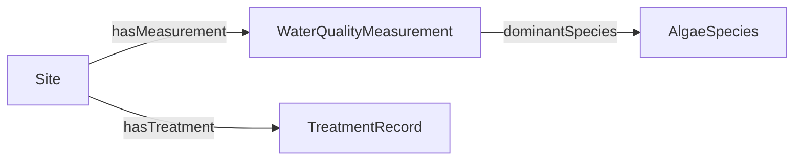

# `ontology/` — Fabric IQ ontology definitions (Phase 3 authoring)

> **Issue:** #20 (EPIC C, #3) · **Phase:** 3 (authoring only — deployment happens in Phase 4)

**Intent.** This directory holds the **source-controlled, declarative definition** of the **Fabric IQ
ontology (preview)** for the water-utilities / algal-bloom scenario: entity types, properties, relationship
types, and the **data-binding specifications** that map them to managed OneLake Delta tables.

Per **Constitution Art. IV**, schema and business vocabulary live here in the ontology — **never** baked into
agent prompts.

## File layout — the `updateDefinition` parts shape

The JSON files below are exactly the **parts** that `scripts/deploy_ontology.py` base64-encodes and posts to
the Fabric `items/{id}/updateDefinition?beta=true` REST API (pattern adapted from `ajananth/research-iq`
`scripts/setup_ontology.py` — **pattern only**; none of that repo's tenant/workspace/item GUIDs are copied
here). The tree mirrors the API's expected part paths:

```
ontology/
  definition.json                                          # root (always {})
  EntityTypes/{et_id}/definition.json                      # entity type schema
  EntityTypes/{et_id}/DataBindings/{uuid}.json             # column→property binding to a managed Delta table
  RelationshipTypes/{rt_id}/definition.json                # relationship type schema
  RelationshipTypes/{rt_id}/Contextualizations/{uuid}.json # key→key binding (the graph edge)
```

- **IDs are stable BigInt strings.** Entity types use `100N000000000001`; their properties use
  `100N0000000001PP`; relationship types use `200N000000000001`. Data bindings and contextualizations use
  fixed UUIDs (committed, so re-deploys are idempotent).
- **No secrets, no hardcoded GUIDs.** The binding files reference the target workspace and Lakehouse via the
  placeholders `${FABRIC_WORKSPACE_ID}` and `${FABRIC_LAKEHOUSE_ID}`, which `deploy_ontology.py` substitutes
  from the environment at deploy time (Constitution Art. VI).

## Entity types (4) — properties = real CSV columns, key = each `*_id`

| Entity type | `et_id` | Source table | Key |
| --- | --- | --- | --- |
| `Site` | `1001000000000001` | `sites` | `site_id` |
| `AlgaeSpecies` | `1002000000000001` | `algae_species` | `species_id` |
| `WaterQualityMeasurement` | `1003000000000001` | `water_quality_measurements` | `measurement_id` |
| `TreatmentRecord` | `1004000000000001` | `treatment_records` | `treatment_id` |

Every CSV column becomes a property (`String` / `Double` / `BigInt` / `DateTime`). See
[`../data/README.md`](../data/README.md) for the authoritative column list and types.

> **Flagged fidelity choice:** the source booleans `active` (Site) and `follow_up_required` (TreatmentRecord)
> are the literal strings `true`/`false` in the CSVs and are modelled as `String`. We deliberately did **not**
> invent an ontology `Boolean` `valueType` (not corroborated by our source of truth); this stays faithful to
> the data and to Constitution Art. I. Revisit in Phase 4 if a `Boolean` value type is verified.

## Relationship types (3) — the graph edges

Each relationship is **typed and directional**. Because our FK columns live **on the fact tables
themselves**, each contextualization binds to that fact table (no separate bridge table): the `source`
key column and `target` key column are both read from one managed Delta table.

| Relationship (`rt_id`) | Direction | Bound table | source col → target col |
| --- | --- | --- | --- |
| `hasMeasurement` (`2001…01`) | `Site` → `WaterQualityMeasurement` | `water_quality_measurements` | `site_id` → `measurement_id` |
| `hasTreatment` (`2002…01`) | `Site` → `TreatmentRecord` | `treatment_records` | `site_id` → `treatment_id` |
| `dominantSpecies` (`2003…01`) | `WaterQualityMeasurement` → `AlgaeSpecies` | `water_quality_measurements` | `measurement_id` → `dominant_species_id` |



## The algal-bloom reasoning path

The three edges exist to let the agent traverse a **cross-domain** question without prompt-baked joins
(Constitution Art. IV; the "semantic contract" headline of the article, `docs/article-outline.md` §S5.5):

1. **Detect** — at a `Site`, follow `hasMeasurement` to `WaterQualityMeasurement` rows with elevated
   `chlorophyll_a_ugl` and `algae_cell_count_cells_ml` (bloom indicators).
2. **Classify** — from that measurement, follow `dominantSpecies` to the `AlgaeSpecies` and read its
   `toxicity_level` and `bloom_trigger_conditions` to judge severity/risk.
3. **Respond** — from the same `Site`, follow `hasTreatment` to `TreatmentRecord` rows to see which `method`
   and `outcome` were effective for comparable past events.

This is the natural fit for **graph traversal** (NL2Ontology → GQL over Graph in Fabric) rather than
prompt-stuffed SQL.

## Constraints to honour (from `docs/verified-capabilities.md` §1a)

- Lakehouse tables must be **managed**, with **no OneLake security** and **no column mapping**.
- Upstream row changes require a **manual graph refresh**.
- The **Graph in Microsoft Fabric** tenant setting must be enabled for graph traversal.

## Status

**Authored, not deployed.** Live application via `updateDefinition` against a real Fabric ontology item
happens in **Phase 4** (issue TBD under EPIC C), behind the Constitution Art. VIII human-in-the-loop gate.
